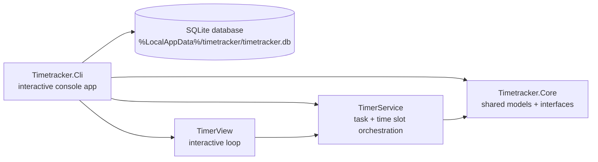

# TimeTracker

A simple command-line time tracking app built with .NET 10.

## Architecture

TimeTracker is currently split into two .NET 10 projects:



- `cli/Timetracker.Cli` contains the executable app, the database context, and the service implementations.
- `libs/Timetracker.Core` contains the shared domain models and service interfaces so the CLI and future API can use the same contracts.


## Run

```bash
dotnet run --project cli/Timetracker.Cli
```

## Usage

The app runs as an interactive loop:

1. Type a task name and press **Enter** to start tracking — you'll see a live ticking clock.
2. Press **Enter** to stop.
3. Leave the prompt empty and press **Enter** to quit.

Timers are saved to a local SQLite database, created automatically on first run.
