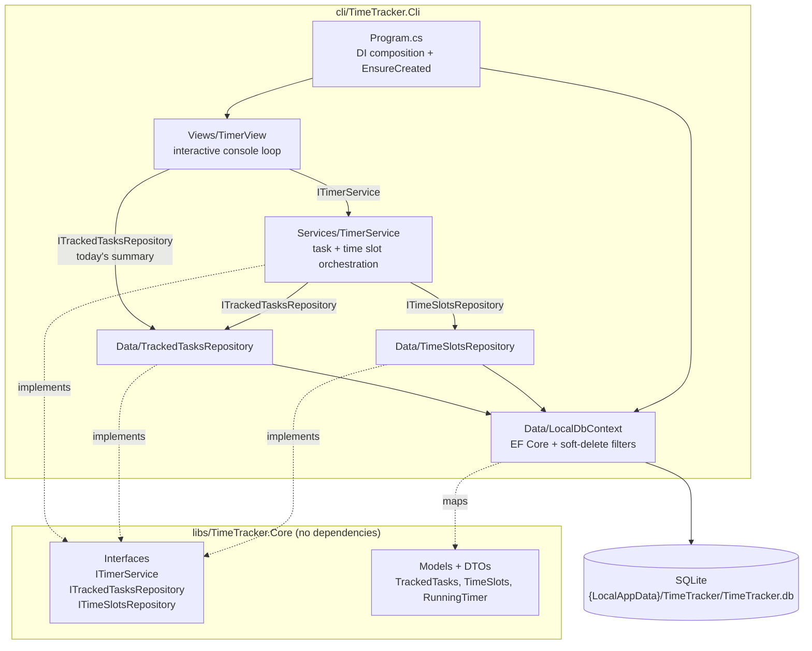

# TimeTracker

A simple command-line time tracking app built with .NET 10.

## Architecture

TimeTracker is currently split into two .NET 10 projects:


```mermaid
flowchart TD
	subgraph cli["cli/TimeTracker.Cli"]
		Program["Program.cs<br/>DI composition + EnsureCreated"]
		View["Views/TimerView<br/>interactive console loop"]
		Service["Services/TimerService<br/>task + time slot orchestration"]
		TaskRepo["Data/TrackedTasksRepository"]
		SlotRepo["Data/TimeSlotsRepository"]
		Db["Data/LocalDbContext<br/>EF Core + soft-delete filters"]
	end

	subgraph core["libs/TimeTracker.Core (no dependencies)"]
		Interfaces["Interfaces<br/>ITimerService<br/>ITrackedTasksRepository<br/>ITimeSlotsRepository"]
		Models["Models + DTOs<br/>TrackedTasks, TimeSlots, RunningTimer"]
	end

	Sqlite[("SQLite<br/>{LocalAppData}/TimeTracker/TimeTracker.db")]

	Program --> View
	View -->|ITimerService| Service
	View -->|ITrackedTasksRepository<br/>today's summary| TaskRepo
	Service -->|ITrackedTasksRepository| TaskRepo
	Service -->|ITimeSlotsRepository| SlotRepo
	TaskRepo --> Db
	SlotRepo --> Db
	Program --> Db
	Db --> Sqlite

	Service -.implements.-> Interfaces
	TaskRepo -.implements.-> Interfaces
	SlotRepo -.implements.-> Interfaces
	Db -.maps.-> Models
```

- `cli/TimeTracker.Cli` contains the executable app, the EF Core data access, the service implementations, and the console UI. `Program.cs` wires everything up as **Scoped** services and creates the schema with `EnsureCreatedAsync()` on startup.
- `libs/TimeTracker.Core` contains the shared domain models, DTOs, and interfaces so the CLI and a future API can use the same contracts. It references nothing.
- Data flows one way: `TimerView` → `ITimerService` → repositories → `LocalDbContext` → SQLite. `TimerView` also reads `ITrackedTasksRepository` directly to print today's totals after a timer stops.


## Run

```bash
dotnet run --project cli/Timetracker.Cli
```

## Usage

The app runs as an interactive loop:

1. Type a task name and press **Enter** to start tracking — you'll see a live ticking clock.
2. Press **Enter** to stop.
3. Leave the prompt empty and press **Enter** to quit.

Timers are saved to a local SQLite database, created automatically on first run.
