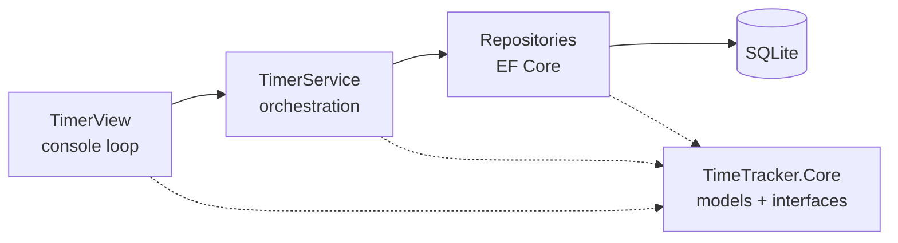

# TimeTracker

A simple command-line time tracking app built with .NET 10.

## Architecture

TimeTracker is currently split into two .NET 10 projects:


```mermaid
flowchart LR
	View["TimerView<br/>console loop"] --> Service["TimerService<br/>orchestration"]
	Service --> Repos["Repositories<br/>EF Core"]
	Repos --> Sqlite[("SQLite")]

	Core["TimeTracker.Core<br/>models + interfaces"]
	Service -.-> Core
	View -.-> Core
	Repos -.-> Core
```

- `cli/TimeTracker.Cli` — the executable: console UI, services, and EF Core data access. `Program.cs` wires it all together with DI.
- `libs/TimeTracker.Core` — dependency-free domain layer: models, DTOs, and the interfaces both sides talk through, so a future API can reuse the same contracts.


## Run

```bash
dotnet run --project cli/Timetracker.Cli
```

## Usage

The app runs as an interactive loop:

1. Type a task name and press **Enter** to start tracking — you'll see a live ticking clock.
2. Press **Enter** to stop.
3. Leave the prompt empty and press **Enter** to quit.

Timers are saved to a local SQLite database, created automatically on first run.
